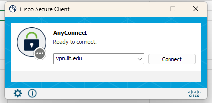

# Cluster Setup Tutorial

This is a short description of the tools we need to setup

## Configure VPN

If you are off of the campus network, connect via the university VPN client to our internal network. You can download the VPN client at [https://vpn-1.iit.edu](https://vpn-1.iit.edu "webpage for the VPN download") for MacOS and Windows (autodetects). 


Use your full `@hawk.iit.edu` email and portal password to authenticate. You will have to 2-factor authenticate as well.

## Connect to VPN

Launch the Cisco VPN tool and connect to `vpn.iit.edu` 



Authenticate using your Portal username and password


Watch out! The two-factor message triggers quickly and doesn't have much patience, make sure to have your phone ready to approve the connection.

## SSH Connection

Now we will test your SSH connection to the `buildserver`. From the terminal on your computer run the follwing command, replacing values of mine with yours:

```bash
ssh -i c:/users/palad/.ssh/id_ed25519_itmo_453_key hajek@system45.rice.iit.edu
```

The `-i` value is the path to the private key that matches the public key you provided to me in the excel Spreadsheet.

The value `hajek` is the username of the account. I created the accounts to use your HAWKID (just the value not the @hawk part), though these account are not related to the university accounts.

The FQDN of `system45.rice.iit.edu` is a virtual machine that we use as a buildserver to issue all of our build commands to our virtual machine cluster.

## VSCode Plugins 

You need to install two VScode Extensions. The `Extensions` store is the 2 by 2 squares icon in the VSCode menu.

* HashiCorp Terraform 
* Hashicorp HCL 


## Buildserver

Network Access: 

The entire cluster works on a single flat CIDR block: 192.168.172.0/24 and there is DNS available for each system. Which is based on the last octet of the IP address

```
system41.rice.iit.edu will resolve to 192.168.172.41 
```

2 Node Proxmox Cluster (Debian Linux running Managed KVM) 


## Cluster Access

For infrastructure deployment we will be using a central buildserver: `system45.rice.iit.edu`.  If you are on the Campus network you do not need to connect to the VPN. If you are off of the campus network then you need to connect to the VPN first. 

Let's connect to our buildserver and retrieve account credentials. An account has been created for you already, it is your HAWK ID (just the ID part, not the @HAWK part). This account is not related at all to your school account.

This account:

* You have a home directory but no sudo access 
* It contains a text file with your API keys to access our Cluster resources for API and Cloud Native deployment 
* Home directories are built using ZFS soft partitions, which allow for partitions that don’t have a fixed disk size. 
  * What Is ZFS?: A Brief Primer by Wendell at Level1techs at https://www.youtube.com/watch?v=lsFDp-W1Ks0 

### Step 1: Connecting to the Buildserver via SSH 

```
ssh -i "C:\Users\palad\OneDrive\Personal Vault\id_ed25519_proxmox" hajek@system45.rice.iit.edu
```

This private key is the key that matches the public key you provided in the excel account document at the beginning of class.

We will use ssh to remotely connect to the buildserver using the `–i` flag and passing the path to the private key

* The IP address is system45.rice.iit.edu (need VPN connected)  
* Your username is your hawkid without the @hawk part 
* There is no connection with your university Hawk account 
* There are no passwords 

### Step 2: Repeat the Git Tutorial Process 

On the buildserver, you will need to generate another ed25519 public private key pair and place the public half of this key pair into your GitHub account as a `Deploy Key` with read-only access.

* Repeat the process from the Git Tutorial on the buildserver 
* Create a config file containing the necessary information in your .ssh directory 
* Clone your own private repo code

### Step 3: Location of credentials

The credentials you will need are located in your buildserver home directory in a file named: `HAWKID-proxmox-credentials.txt`.

The first paragraph will contain your Cluster web console credentials. The next text blocks surrounded by textboxes will contain API Access and Secret Keys for building and deploying virtual machine artifacts via Packer and Terraform on the Proxmox cluster.

### Step 4: Example code for initial Vault construction

There are Packer templates available in the [https://github.com/illinoistech-itm/jhajek](https://github.com/illinoistech-itm/jhajek "webpage for jhajek sample code repo") repo. You can also clone this to your own local system to further investigate the code base. BE CAREFUL! Not to clone the jhajek repo into another existing repo. Git can become confused when repos are embedded inside of each other. 


```
itmt-430 > example-code > production
```
This folder includes: 

* You need to go through the process of filling out the `variables.pkr.hcl` with the provided credentials to build your Vault Server 
* The first vault template: `promox-jammy-vault-template` 
  * You will be managing your own secrets 
  * We need to build a Vault server first
    * We will build it the same way we did the in the Vault Tooling Assignment

Make sure to execute these commands: 

* `packer init .` (first time only) 
* `packer validate .`
* `packer build .`

These steps will complete and build an Ubuntu server with Vault, the `.bashrc`, and the firewall pre-configured via Packer's provisioning system. This will create a VM template on the Proxmox Cluster in which we can deploy arbitrary number of VMs via Terraform.
